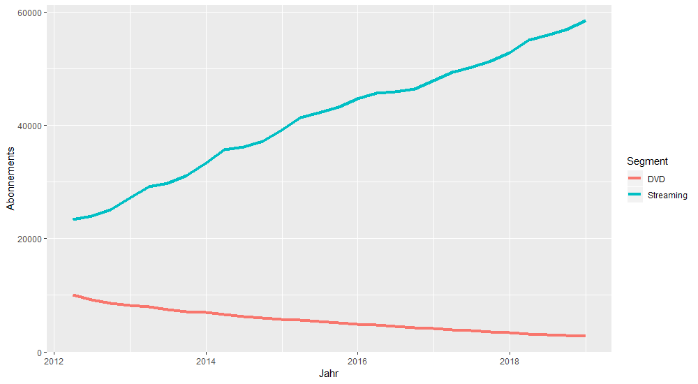

# Netflix Cost Analysis
Analysis of Cost per Netflix user in the Domestic Streaming and DVD Business.

## Data Sources
The Analysis is based on Segment Information obtained from [Financial Releases](https://www.netflixinvestor.com/financials/quarterly-earnings/default.aspx) form Netflix in the years 2012-2018 

## Results
### Number of users

### Cost per User in relation to Number of Users

